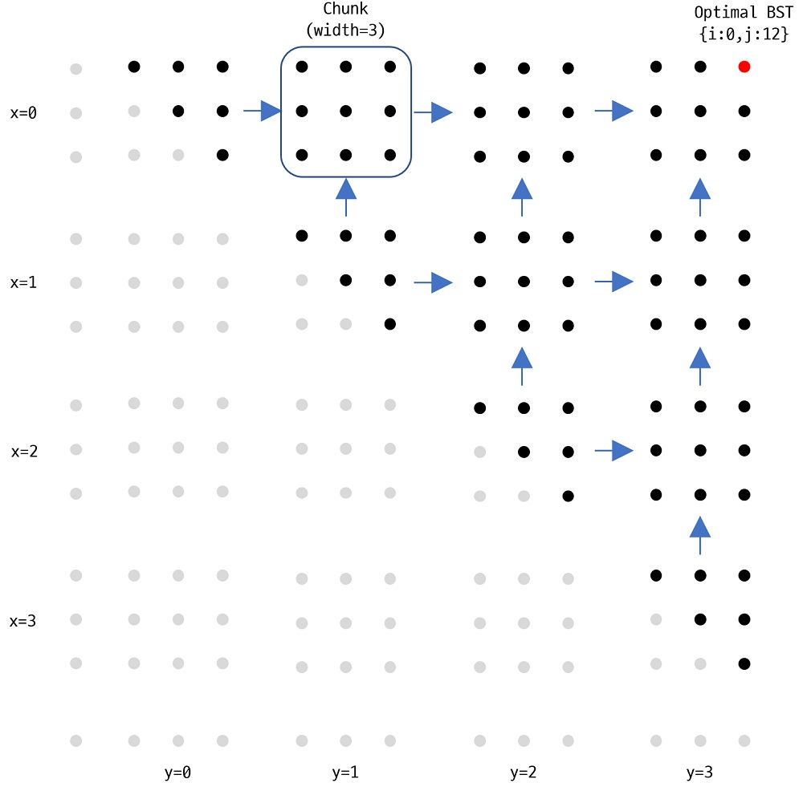
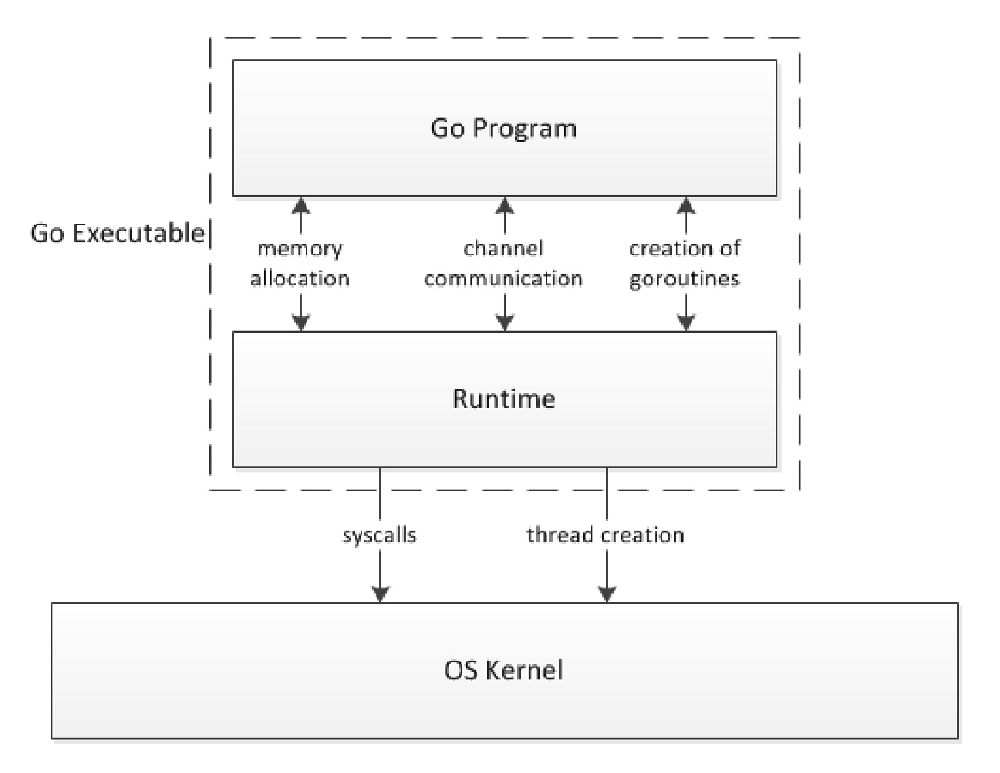
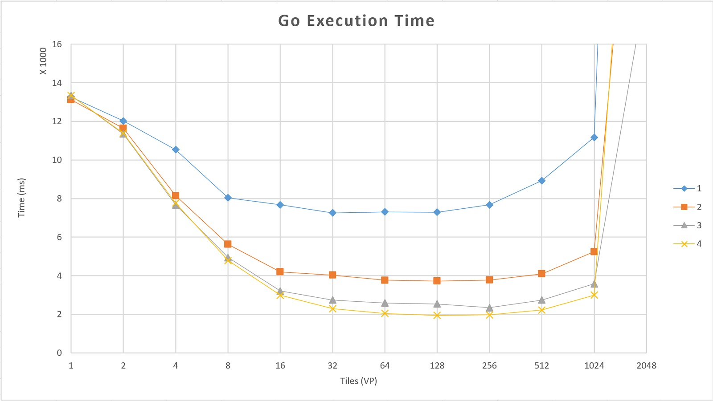
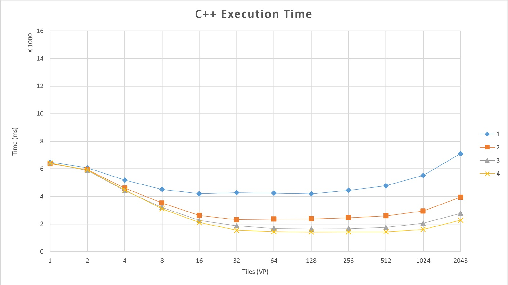
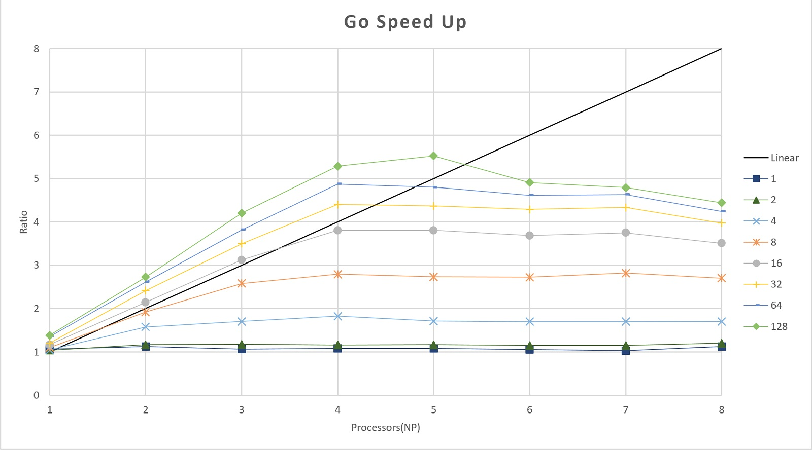
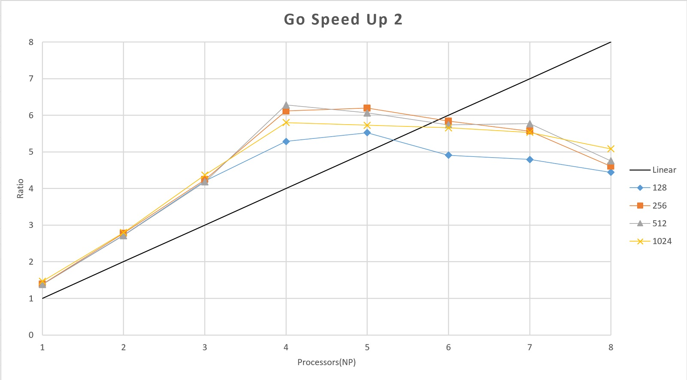
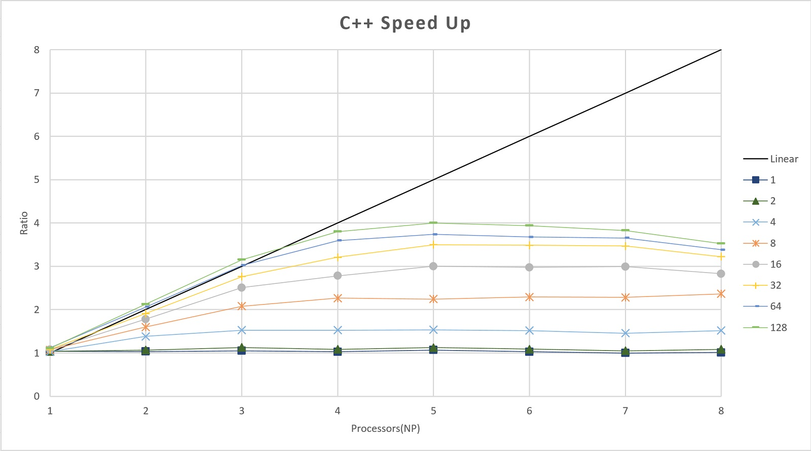
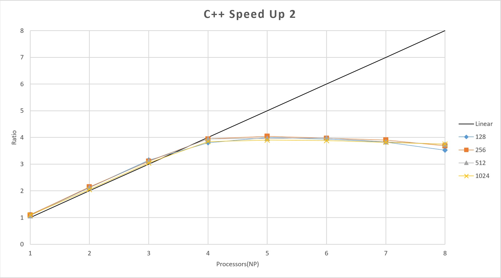
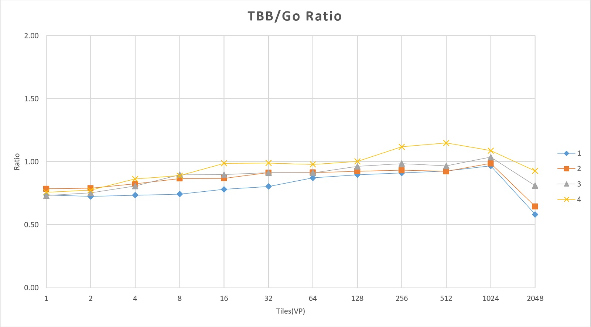

# Comparison of Go and C++ TBB on Parallel Processing 

#### Author
 - Park Dong Ha ( luncliff@gmail.com )  
  Dept. of Computer Science and Engineering, Dongguk University

### Abstract
Applying concurrent structure and parallel processing to multi-core environment program is common issue of these days. In this research, dynamic programming problem is used to compare parallel processing performance of Go language and Intel C++ Thread Building Blocks library.

Following prior research of Doug Serfass and Peiyi Tang [4], Static Optimal Binary Search Tree is reused as an example of dynamic programming. The experiment was performed on 4 Core machine and its result contains execution time under simultaneous multi-threading environment.

From the result, with parallelism, Go and C++ TBB obtained 6.28 and 3.95 times faster performance for each. In general, TBB performed better and 1.37 times faster in both languages' best condition. But in specific conditions, Go performed 1.15 times faster.

### Keywords
C++ Language, Intel TBB, Go Language, 
Parallel Processing, Performance Comparison

## 1. Introduction
### 1.1. Motivation

Conventionally, Standard C++ was applied for performance critical programs. Nowadays, multi-processor environment became normal and C++ is still in use with modernized standards and concurrency/parallel libraries [1]. However, Go language supports communicating sequential process programming model with its language primitives, Goroutine and channel types. [2] Because of these features, both languages are thought as appropriate languages for such environment. Especially Go language is gathering interests constantly. [3] 

In 2012, Doug Serfass and Peiyi Tang's research [4] compared parallel performance of C++ TBB library and Go language. Since both language kept evolving from the time, there are 2 goals for this research. First one is re-implementing the code with latest version of both languages and acquiring latest comparison result for the same issue. And next one is to perform experiment again and to analyze its results. 

### 1.2. Sections

The paper contains 5 more sections and reference list. Section 2 summarizes related works that affected this research. Section 3 describes common issues of for the research problem. Section 4 describes experiment's concept and related factors. Section 5 focus on the experiment results and analyze them. At last, section 6 concludes the research.

## 2. Related Works
Ensar Ajkunic et al. [1] compared 5 programming models with C++ parallel libraries. It compares threading model, directive based model, task based model, and distributed/shared model. It parallelized matrix multiplication with the libraries, and provided implementation for each model. 

Doug Serfass and Peiyi Tang [4, 5] gave the motivation for this research. Peiyi Tang [5] analyzed performance of general fork-join parallelism in early Go language. It’s target problem contained processing of static optimal binary search tree, which requires data synchronization between sub-problems. Doug Serfass [4] extended the research and compared performance of C++ TBB and early Go, by processing optimal binary search tree.

Neil Deshpande et al. [8] analyzed old code of Go runtime scheduler and its mechanism. At the time, Go language’s runtime was written in C. Since Go 1.5 release, the codes are converted to Go language but the structure is still being retained.

Carl Johnell‘s research [10] compared Go and Scala with matrix multiplication and chained multiplication problem. In this case, Scala performed better with low number of actors. It also compared 3 ways to implement matrix in Go, and compared performance with disassemble results of them.

Arch Robison at el. [13] discuss optimization of C++ TBB for nested parallelism and cache affinity for task processing. It referenced description of work stealing mechanism and library internal flow. 


## 3. Research Problem
### 3.1. Task-Level Parallelism
Parallel programming is about performing multiple computation at the same time. The computation problem is divided into smaller sub-problems, and processed with multiple processors. Parallelism level varies with its granularity. This research applies task-level parallelism.

Task is a unit of work in a program. Simply, it is stream of instruction and executed by a single processor. Here, processor is logical entity for program execution. It can be OS process/thread, or runtime abstraction of language. Erlang Process and Goroutine in Go Language are example of such an abstraction. With this scheme, algorithm of program is represented as directed acyclic graph of tasks. 

The focus and reason for parallelism is speed-up, which is efficient hardware utilization in general means. But it also requires correctness for the program order. Programmer must synchronize data for separated tasks and operation for symmetric multiprocessor environment. Since manually managing tasks, processors and synchronization greatly increases complexity of program, recent parallel programming interfaces use task scheduling system with their own policy. Task scheduling manages executable tasks' state and maps them to processors. Mapping procedure can be cooperative or preemptive like scheduling of OS. Works, which are basically group of tasks, are distributed dynamically for load balancing.

### 3.2. Dynamic Programming
The major benefit of dynamic programming is efficient use of computation power. The approach of dynamic programming is to separate large, complex problem into smaller, simple sub-problems. And each sub-problems' result are stored on the memory location. Those results can be reused for larger sub-problem later. This approach combines time/space trade-off and specific algorithm for sub-problems.

In some cases, sub-problems can have data dependency. Algorithm for such problem must manage the dependency with embedded ordering. For sequential code, smaller sub-problems are timely processed prior to larger sub-problem. Then, larger sub-problem is processed with the results of its dependent sub-problems.

### 3.3 Parallel Processing of Optimal Binary Search Tree
Like previous research, [4, 5] this research uses static optimal binary search tree as an example of dynamic programming. Optimal binary search tree is a kind of balanced search tree, and it provides smallest search time for nodes with given access probability. The OBST's definition is recursive, and requires `O(N*N)` time for construction with Knuth’s algorithm. [6]


##### Figure 1 : Knuth's algorithm for the OBST [6]
  

In this case, sub-trees match with sub-problem concept for dynamic programming. Considering larger sub-tree have data dependency to smaller sub-tree. The dependency relation constructs graph and can be reduced like [Figure 2]. [4] Notice that the relation forms directed acyclic graph. Applying task-based algorithm design, each sub-tree becomes task and dependency arrows are synchronization points for them.

##### Figure 2 : Reduced Graph of Data Dependency
  

## 4. Experiment
### 4.1 Change in code

However, contrast to previous research, there were 2 changes in code. 

First, compile time constants are removed. Source embedded constants can trigger compiler optimization such as constant folding. And such a constant enforces static memory allocation for OBST. Static memory allocation can be fast method for processing. However, in general program, most of problem size can't be decided statically. In this implementation, memory for OBST is dynamically allocated and the factors are provided at launching time with command line argument. But the allocation time for tree is ignored.

Second, the experiment take account of memory cost for parallelism. In previous design, space overhead for parallelism was managed at global scope. In that design, especially, Go language's garbage collection could lead to unfair execution time measurement. In this implementation, parallel overhead is managed in local scope and GC clean-up is manually triggered with blocking function. Like simplified code of [Figure 3], execution time is measured only for the scope.

##### Figure 3 : Pseudo code for performance evaluation
```c++
OBST  tree = MakeTree(N); // Dynamically allocated Optimal BST 

Timer t;
t.reset();

if (parallel == true){
     APISetup();
     ParallelEvaluate(tree, VP)
     CleanUp();     // Manual Resource Clean-Up
}
else{
     SequentialEvaluate(tree)
}

Duration elapsed = t.pick(); // Consider processing scope only
```


### 4.2. Concept

##### Figure 4 : Problem Concept
  

There are 3 major factors for the program. [Figure 4] shows the implementation view of the target problem. First, `N` is problem size. In [Figure 4], `N` is 12. but notice that the actual memory space usage is `(N+1)*(N+1)` because of dummy (gray dots). These gray dots are out of valid range but inserted for algorithm code's simplification. [4,5]

VP determines total number of chunks. In [Figure 4], `VP` is 4. And 10(=`1⁄2*VP*(VP+1)`) chunks are created. Since creating tasks for each tree (black dot) is wasteful, group of sub-trees are chunked like the rounded rectangle. When `VP` is too low, the total number of task group decreases and processors might calculate dummy trees more than necessary. On the other hand, with high `VP`, scale of tasks become small and it results in frequent synchronization(arrow) for processing.

`NP` is number of physical processors. But with simultaneous multi-threading, this value becomes the number of OS threads. Since thread is managed mutually by scheduler, this factor affects to scheduling and processor synchronization. 

In experiment, the factors are applied like followings.
 - `N`	: 2048 4096
 - `NP`	: 1 ~ 8
 - `VP`	: 1 ~ 2048 (1,2,4,8...)


### 4.2. Approach of Go

The Go language's programming model is affected by Communicating Sequential Process. It supports Goroutine as its light-weight processor. And the processors communicate via channel. With channel type, messages are forwarded to processors and they can handle it without consideration of shared memory synchronization. For memory management, Go uses garbage collection. In Go 1.5 release, stop the world time latency is reduced to millisecond level. [7]

Simply attaching go keyword, the Goroutine is spawned and managed by Go runtime scheduler. Even if the number of processors surpasses that of threads greatly, their execution is guaranteed. The channel is basically lock-based, bounded queue with list of readers and writers. Operations on channel can affect processors' state and trigger scheduling.

For instance, when the channel is empty, consumer Goroutines' state becomes waiting. After the Goroutine is parked, scheduler maps another runnable Goroutine to the OS thread. In this procedure, scheduling function uses global scheduler lock to thread-safely map those runnable Goroutines. [8, 9] When the channel is filled, waiting Goroutine is notified and marked as runnable state. 

##### Figure 5 : Structure of Go Application [8]
  

##### Figure 6 : Go implementation
```go
// Chunk ...
func Chunk(
    tree *obst.Tree,
    i int, j int, width int,
    dep *Dependency) {

    // 1. Wait for pre-set...
    dep.Wait()

    // 2. Sequential processing
    for row := i - 1 + width; i <= row; row-- {
        for col := j; col < j+width; col++ {

            root, cost := tree.Calculate(row, col)
            *tree.Root.At(row, col) = root
            *tree.Cost.At(row, col) = cost
        }
    }

    // 3. Notify to post-set...
    dep.Notify()
}
```

In Go implementation, each chunk is processed by Goroutine, and synchronized via channel. Especially matrix implementation referenced Carl Johnell’s research. [10]


### 4.3. Approach of C++ TBB
Intel's TBB (Thread Building Blocks) library is thread pool with task scheduling system. [11] It uses OS thread for processor, and they execute programmer's tasks with polymorphism. For this, programmer should provide task implementation. In the code, data for sub-problem become task class's member variables, and operations become member functions. Dependency between task instances is expressed with reference counter. Therefore, each task must decrement count of its successor tasks to reach the end. When the spawned task's counter becomes 0, then the task becomes executable. [12]

Like Figure 3, these concrete tasks compose a directed acyclic task graph, with embedded algorithm. After a group of tasks are spawned at runtime. The scheduler maps spawned tasks with its own policy. [13] The policy is designed to utilize cache efficiently. For work execution, it traverse task graph in depth-first order so that most recent contents can be reused. On the other hand, for work stealing, breath-first order is applied. Furthermore, the library manages thread affinity internally [13].

##### Figure 7 : C++ TBB implementation 
```c++
// - Note
//      Task to process chunk.
class ChunkTask : public tbb::task
{
private:
    Tree&   tree;   // Reference for OBST
    i32     i, j;   // Top-left index of chunk
    i32     width;  // Chunk's width
public:
    // No preset. Post set only
    tbb::task* post_set[2]{};
   
public:
    void notify();

    tbb::task* execute() override
    {
        // No wait...

        // In range of chunk, process sequentially.
        for (i32 row = i-1 + width; row >= i; --row) {
            for (i32 col = j; col < j + width; ++col)
            {
                // Calculate without side-effect
                auto root_cost = Tree::Calculate(tree, row, col);
                // Assign results
                tree.root[row][col] = std::get<0>(root_cost);
                tree.cost[row][col] = std::get<1>(root_cost);
            }
        }

        // Notify successors and enqueue to scheduler
        this->notify();
 
        return nullptr;   // No task bypass
    }
}
```
In TBB implementation, each chunk becomes task instances and processed by OS threads, and synchronized via reference counter.


### 4.5. Environment
#### OS/Processor
 - Windows 10 Pro (Build 14393)
   - Power Option : High Performance
 - Intel 64-bit / i7-6700HQ 2.60 GHz 
   - 4 Core (8 Thread with Hyper Threading)
   - 6M Cache

#### Go
 - Version: 1.7.4 windows/amd64
 - Compiler: Golang built-in

#### C++ TBB
 - Version: 2017 Up 3
 - Compiler: MSVC v14 (Visual Studio 2015 Commmunity Up 3)


## 5. Result/Analysis

### 5.1. Execution Time
The execution time is estimated 5 times for each condition and averaged. Timer is implemented with language built-in time library. For unit of time, millisecond was used. In general, TBB performed better than Go and their aspect was quite similar. [Figure 8] is record of execution time with fixed `N=2048` condition. Average time for sequential code was not plotted on chart, but C++ TBB and Go took 6255.4, 12698.6 milliseconds for each.

##### Figure 8 : Execution Time with `N=2048` (a) Go  (b) C++ TBB 
  
  

For parallel code, when `NP` was restricted to 1, the performance varies upon VP factor. As `VP` grows, the performance increases until `VP=128`, but starts to decrease after `VP=256`. This is because of parallel code's chunking policy.

When `VP=1`, the range of a single chunk becomes 2 times larger than sequential code. The elapsed time for TBB was 6488.6 milliseconds (Go: 13266.2 ms). For `VP=64` condition, with much lesser cover range and processing chunk by chunk, the data locality became efficient. As the result, the time for TBB was 4231.6 milliseconds (Go: 7309.4 ms). This is much better than sequential code.

As `VP` exceeds 256, the overhead for parallelism increases. The major overhead was data structures for chunk and their synchronization. As `VP` grows, the more space for chunk is allocated, the more their data locality drops and synchronizations are required. Considering the number of chunk follows `O(VP*VP)`, their total cost isn't negligible in high `VP` condition.

Assuming TBB's reference counter is implemented with atomic integer, its cost depends on architecture. However, Go's channel-based code, can trigger scheduling much frequently. As previously noted, the scheduling uses global scheduler lock and this kind of serialization can become a bottleneck. [Figure 9] shows channel waiting code. If Goroutine's context is bad, it requires 2 times more scheduling than TBB.

##### Figure 9 : Chunk Synchronization with Go channel
```go
// Dependency ...
//      Set of channels for chunk synchronization
type Dependency struct {
     PreSet [2]chan int
     PostSet [2]chan int
}

// Wait ...
//      Wait for pre-set's notification
//      The order is related to EvaluatePar's spawning loop
func (rcv *Dependency) Wait() {
     // Wait vertical channel first
     if rcv.PreSet[V] != nil {
          <-rcv.PreSet[V]     // !!! Require scheduling !!!
     }
     // Wait horizontal channel
     if rcv.PreSet[H] != nil {
          <-rcv.PreSet[H]     // !!! Require scheduling !!!
     }
}
```
Interestingly, Go's performance often dropped vastly when VP=2048. With this highest `VP` and `NP=1`, the execution time was in range of 72140 ~ 90605 milliseconds. And with `NP=4`, it varied between 4899 ~ 66603 milliseconds. Based on profiling [14], this over 1 minute time was resulted from several functions of Go `runtime` package. Especially `schedule`, `stackfree`, and `gentraceback`. Each function consumed nearly 36%, 18%, 40% of total CPU time. Eventually, actual processing time was estimated about 20.23% (`Chunk` function).

In contrary, when the result was under 5000 milliseconds, their consumptions were 9.5%, 2%, 0.01%. With 70.22% of actual processing time, synchronization (channel send/recv operation) spent 10.6% of total. Additionally, CPU usage of GC-related procedures were under 2%. Considering these synchronization cost and short GC latency, the vast increase of execution time can be a malfunction of Go runtime. But this issue isn't clear since it didn't occur in another environment. (Ubuntu 16.04 LTS, Linux Kernel 4.8.1, Go 1.7.3)


### 5.2. Speed Up
When N=2048, the best condition for both language was `NP=4` and `VP=128`. And their aspects were similar in `N=4096` condition, which is 4 times larger scale. But in this case, the execution time increase at least 9 times of `N=2048`. It represents that the scale exceeded much more than the cache can boost up the program.

The following figures shows speed up of parallel code. The value is calculated upon `(Parallel Time)/(Sequential Time)`. However, under SMT (Simultaneous Multi-Threading) environment, their performance dropped as thread context increases.

##### Figure 10: Go Speed up with `N=4096` (a) Low `VP` (b) High `VP`
  
  
Go's speed up was over the linear until `NP` reaches the maximum number of physical processor. When `VP=512`, it achieved best performance. The performance was 6.28 times faster than sequential time. 


##### Figure 11 : TBB Speed up with `N=4096` (a) Low `VP` (b) High `VP`

  
  

Unlike Go, speed up of C++ TBB didn't go over the linear line, but considering its sequential time was much faster than Go, the result fits better for initial part of Amdahl's Law speed-up graph. The best performance was achieved when `VP=256`, and the ratio was 3.95.

### 5.3. Ratio

With problem size `N=2048`, TBB was always faster than Go. Because of previous issue that vast increment of Go execution time, The `VP=2048` condition is ignored. Go/TBB ratio was 1.37 when `NP=4` and `VP=128`. 

But with larger size(`N=4096`), Go was a little bit faster than TBB under their best condition. Go was faster than TBB when `N=4`, `VP=256`, and `VP=512`. Each ratio of them was 1.12 and 1.15. In other words, Go was 15% faster than TBB. 

##### Figure 12 : Execution Time Ratio with `N=4096` (a) Go/TBB (b) TBB/Go
  
  


## 6. Conclusion

In this research, parallel processing for dynamic programming was used for performance comparison. The research problem was calculating static optimal binary search tree with task-level parallelism. Processing codes are re-implemented with C++ TBB and Go. But unlike previous research, the code removed embedded constants and take memory cost into account. Such as garbage collection and destruction of scheduler. For chunk processing, TBB used concrete task class with polymorphism, and Go used Goroutine. Data synchronization methods for each language were reference counter (for C++ TBB) and lock-based channel (for Go). 

Experiment environment provided 4 physical core and 8 logical threads with simultaneous multi-threading. When thread context was equal to the number of core, the speed-up was almost linear. As the context increases, SMT resulted in lower performance. 

For problem size of 2048, TBB was faster than Go in all conditions. When both language performed best, the TBB was 1.37 times faster. However, on larger problem size (4096), Go's best performance was higher than TBB's best. In the case, TBB/Go time ratio was 1.15. With 4 thread, TBB’s best parallel speed-up ratio was 4.41, and that of Go was 6.53.

With the latest language/library version, Go's performance improved greatly and was better than the other under specific condition. Even though TBB is still fast in general, the result presents that Go became considerable alternative in parallel processing program.


## 7. References

 1. **[Ensar Ajkunic '12]** Ensar Ajkunic, Hana Fatkic, Emina Omerovic, Kristina Talic, Novica Nosovic.   
    [A comparison of five parallel programming models for C++](http://ieeexplore.ieee.org/abstract/document/6240936/)   
    May 2012, MIPRO
 1. [The Go Programming Language Specification](https://golang.org/ref/spec)
 1. [TIOBE Index for January 2017](http://www.tiobe.com/tiobe-index/). 
 1. **[Doug Serfass '12]** Doug Serfass, Peiyi Tang.   
    [Comparing parallel performance of Go and C++ TBB on a direct acyclic task graph using a dynamic programming problem](http://dl.acm.org/citation.cfm?id=2184575)   
    March 2012, ACM
 1. **[Peiyi Tang '10]** Peiyi Tang.   
    [Multi-Core Parallel Programming in Go](http://www.ualr.edu/pxtang/papers/acc10.pdf)  
    Jan 2010, Advanced Computing International Conference 2010
 1. Wikipedia, [Optimal Binary Search Tree](https://en.wikipedia.org/wiki/Optimal_binary_search_tree).  
 1. Austin Clements, Rick Hudson.
    [Proposal: Eliminate STW stack re-scanning](https://github.com/golang/proposal/blob/master/design/17503-eliminate-rescan.md)  
 1. **[Neil Deshpande '12]** Neil Deshpande, Erica Sponsler, Nathaniel Weiss.  
    [Analysis of the Go runtime scheduler](http://www.cs.columbia.edu/~aho/cs6998/reports/12-12-11_DeshpandeSponslerWeiss_GO.pdf)   
    2012
 1. Google, [`/src/runtime/proc.go` : `func schedule()`](https://golang.org/src/runtime/proc.go)  
 1. **[Carl Johnell '15]** Carl Johnell.  
    [Parallel programming in Go and Scala : A performance comparison](http://www.diva-portal.se/smash/get/diva2:824741/FULLTEXT03.pdf)  
    2015, Faculty of Computing Blekinge Institute of Technology
 1. [Intel C++ Thread Building Blocks](https://www.threadingbuildingblocks.org/)  
 1. [How Task Scheduling Works](https://software.intel.com/en-us/node/506103#tutorial_How_Task_Scheduling_Works)   
 1. **[Arch Robison '08]** Arch Robison, Michael Voss, Alexey Kukanov.     
    [Optimization via Reflection on Work Stealing in TBB](http://ieeexplore.ieee.org/document/4536188/)  
    2008, Intel Corporation
 1. [Profiling Go Programs](https://blog.golang.org/profiling-go-programs) 

